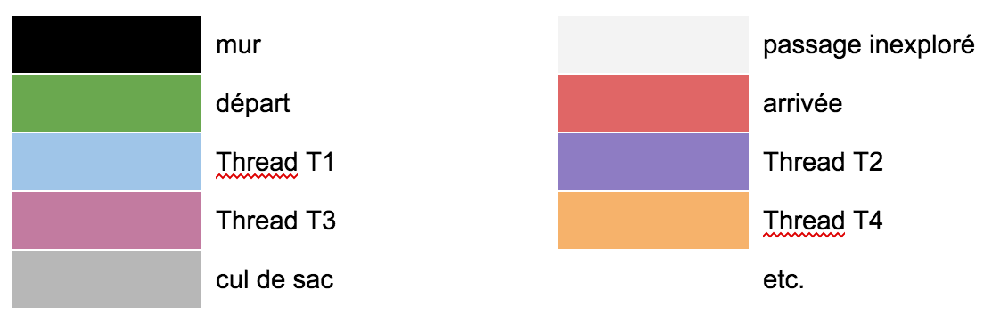

# iMAZE
Amener NAO à résoudre un labyrinthe le plus rapidement possible.

## Objectif
NAO doit être capable de trouver son chemin dans un labyrinthe 2D dont on fournit une image papier avec des repères sur 3 des bords (cf : QRCode). NAO le scannera en une image PNG carrée de x * y cases (longueur et largeur fixées au préalable dans NAO). NAO déterminera la forme du labyrinthe en utilisant un code couleur (noir pour les murs, blanc pour un chemin inexploré, etc.).

## Code couleur


## Fonctionnement
NAO détermine dans un premier temps la case de départ après avoir bouclé sur toutes les cases, récupéré le code couleur, puis déterminé laquelle a le bon code (RGB). Il va ensuite avancer case par case, dans l’objectif d’arriver sur la case d’arrivée. Pour cela, il va créer un thread par chemin possible, puis mettre à jour l’image au fur et à mesure de la synchronisation entre les threads. A la fin, il détermine quel chemin est le plus court en termes de cases et l’indique comme solution. Puis le programme C++ envoie à NAO les coordonnées pour que ce dernier indique au doigt sur l’image le bon chemin.

### Threads
On souhaite utiliser les threads pour gérer les différents chemins simultanément. La difficulté étant la synchronisation des résultats (éviter les demi-tours, de prendre un chemin déjà emprunté et ne menant à rien, etc). Pour les coordonnées, le script utilisera le nombre de cases ET les dimensions de l’image en pixel. Les différents chemins ne menant pas encore à un cul-de-sac seront enregistrés dans un tableau, le temps de finir le traitement.

### Sortie de secours
Si jamais on n’arrive pas à faire ce qu’on désire en C++, il est possible de le faire en utilisant la librairie GD avec un script PHP, qui se sert du code couleur RGB d’une position en pixel (X;Y) pour déterminer une action à effectuer.

## Team
```
Clément Milon
Malo Blanchard
Benjamin Tessier
Nathan Badaud
```

## Docker

### build
```
docker build -t imaze .
```
### Launch container
```
docker run -it --rm --name running-imaze imaze
```
### Launch container + open a SSH connection
```
docker exec -it --rm --name running-imaze imaze bash
g++ main.cpp -std=c++11 -o main
./main
```

